# QR Menu Studio

**Turn a restaurant's paper menu into a fast, beautiful web menu and printed QR codes in about ten minutes.**

QR Menu Studio is a self-hosted Django application for setting up QR-code menus for French
restaurants. The admin photographs the paper menu, AI reads it into dishes and prices, a few
corrections are made on a phone-first editor, and the restaurant gets a permanent menu URL,
print-ready table stickers and table tents. Diners scan the code and get a page that loads in
under a second on 4G, in French or English, with allergen filters and five hand-designed themes.

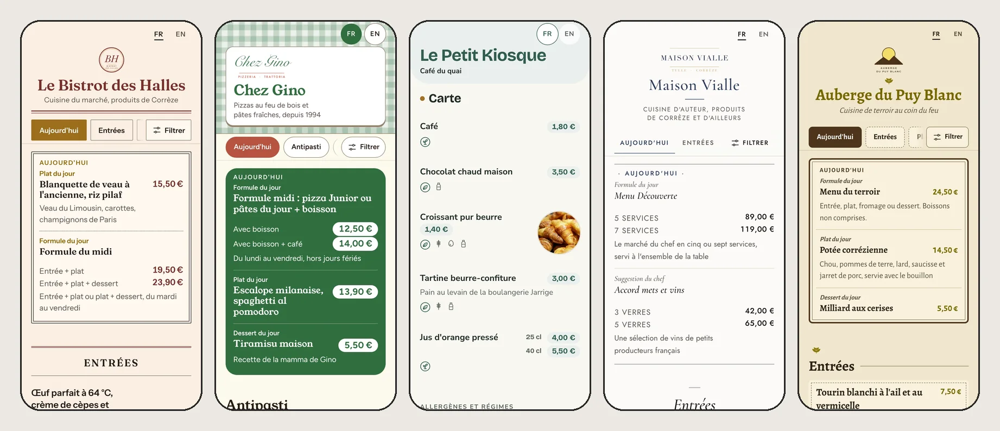

<p align="center"><sub>Bistro · Trattoria · Café · Gastro · Auberge — every theme also has a dark mode and adapts to the restaurant's brand colour.</sub></p>

## Highlights

- **Server-rendered and tiny.** One HTML response with inline critical CSS, about 15 KB gzipped
  for an 80-dish menu, ~3 KB of vanilla JS, self-hosted fonts. Lighthouse mobile (slow 4G):
  **Performance 98–100, Accessibility 100, Best Practices 100, SEO 100** on all five demo menus.
- **Colour-safe theming.** The restaurant picks any brand colour; palettes are computed in OKLCH
  and clamped per role so every text/background pair meets **WCAG AA** in light and dark mode.
- **AI menu import.** Claude vision extracts categories, dishes, descriptions and prices from up to
  six photos into validated structured output; nothing is saved until the owner reviews it.
  One click translates every missing English field.
- **Print-ready output.** QR codes as SVG/PNG in the brand colour (automatically darkened when too
  pale to scan), A4 sticker sheets with cut marks and A5/A6 folding table tents, generated as PDF.
- **Built to run unattended.** Docker Compose (gunicorn + Caddy with automatic HTTPS), SQLite in
  WAL mode, content-versioned page cache with ETags, online backups with one-command restore.
- **Tested.** ~300 unit tests (pytest), Playwright end-to-end tests that decode the printed QR
  codes, axe-core accessibility gates and a written diner-UX checklist.

## The diner's side

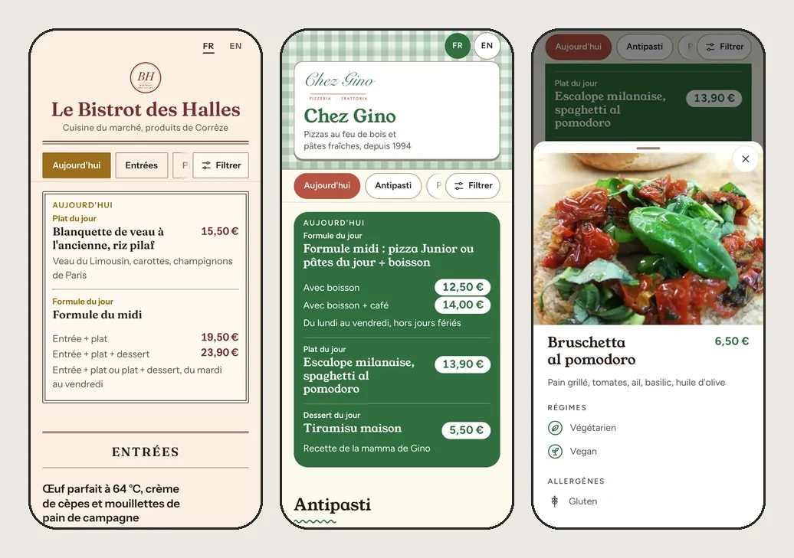

- Sticky category chips with scroll-spy, a "Today" block for the *plat du jour* and *formule*.
- Dish bottom sheet with photo, diets and the 14 EU allergens; the Back button closes it.
- Search and allergen/diet filters; dishes without allergen data are never hidden by a filter.
- Sold-out dishes are greyed out rather than removed. FR/EN switch remembered in a single
  preference cookie, no tracking, works without JavaScript.

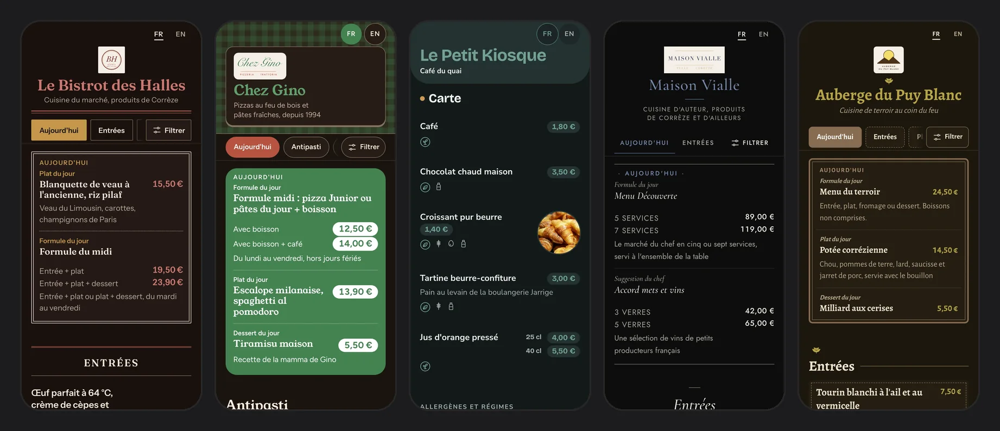

## The admin's side

### Menu editor with live preview

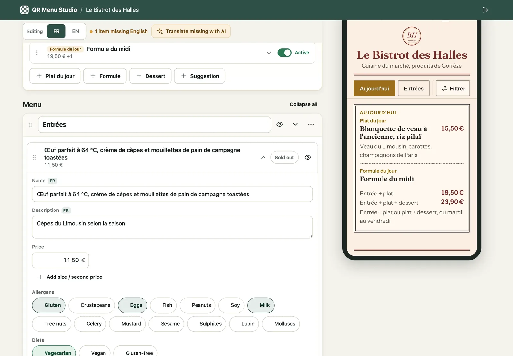

Phone-first editor built with HTMX: autosave as you type, drag-and-drop ordering, French
price input (`12,50`, `12.5` and `12€50` all work), several sizes per dish, allergen and diet
chips, photo upload from the phone camera, undo on delete. The preview next to it lets the owner
try other themes, dark mode or a menu without photos before committing.

<table>
  <tr>
    <td width="33%">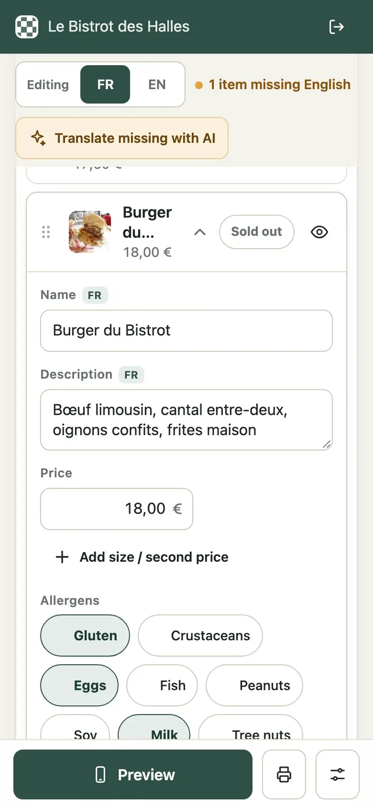</td>
    <td>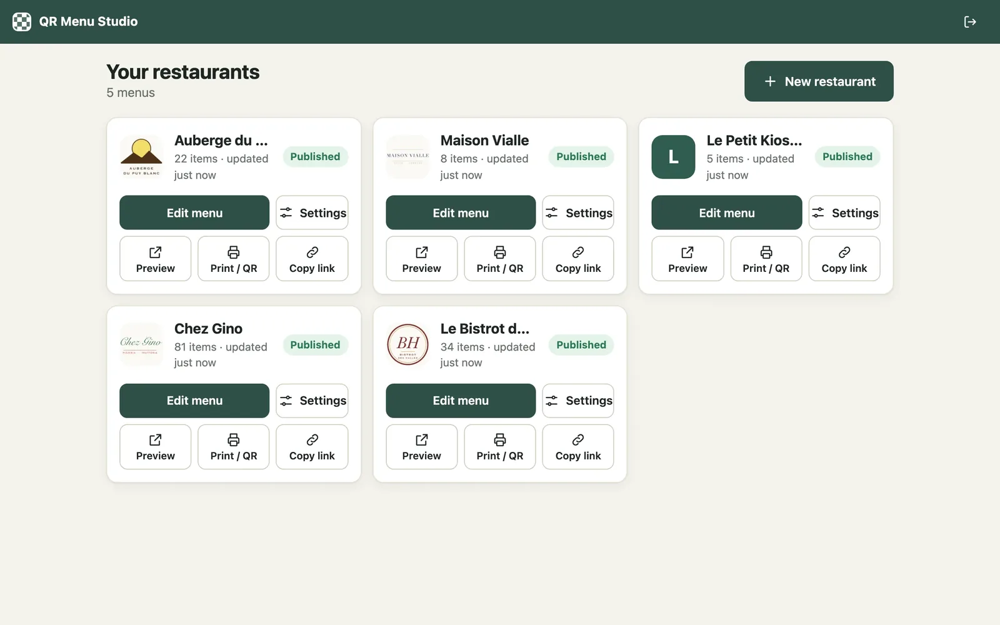<br><br>
        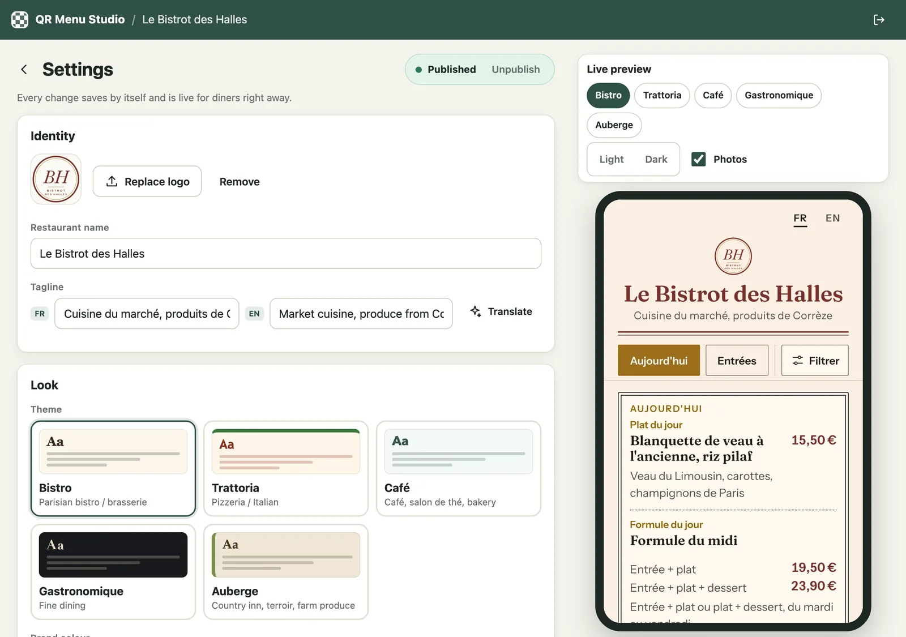</td>
  </tr>
</table>

### AI import from photos

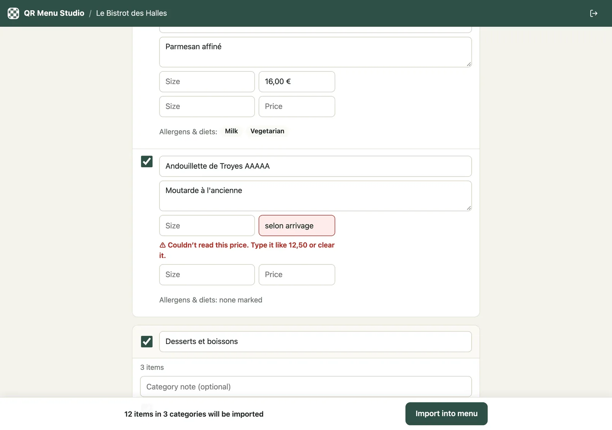

Photos are resized before upload, sent to the Claude API and parsed into a pydantic schema.
The review screen flags anything uncertain, such as a price written as "selon arrivage", and
lets the owner untick items, rename categories, merge into existing ones and import the daily
specials. Without an API key the feature is hidden and everything else keeps working; `AI_FAKE=1`
returns a canned menu for demos and tests.

### QR codes and print

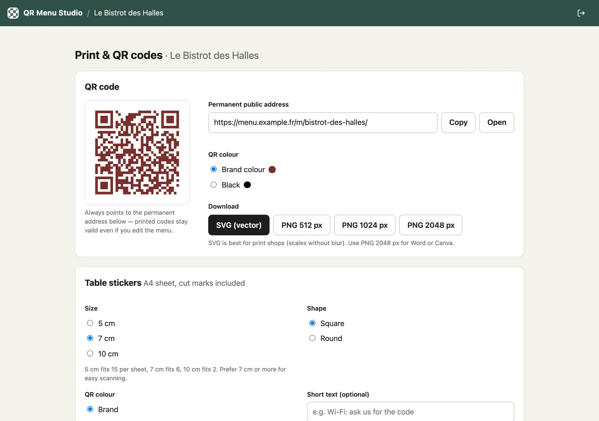

<table>
  <tr>
    <td>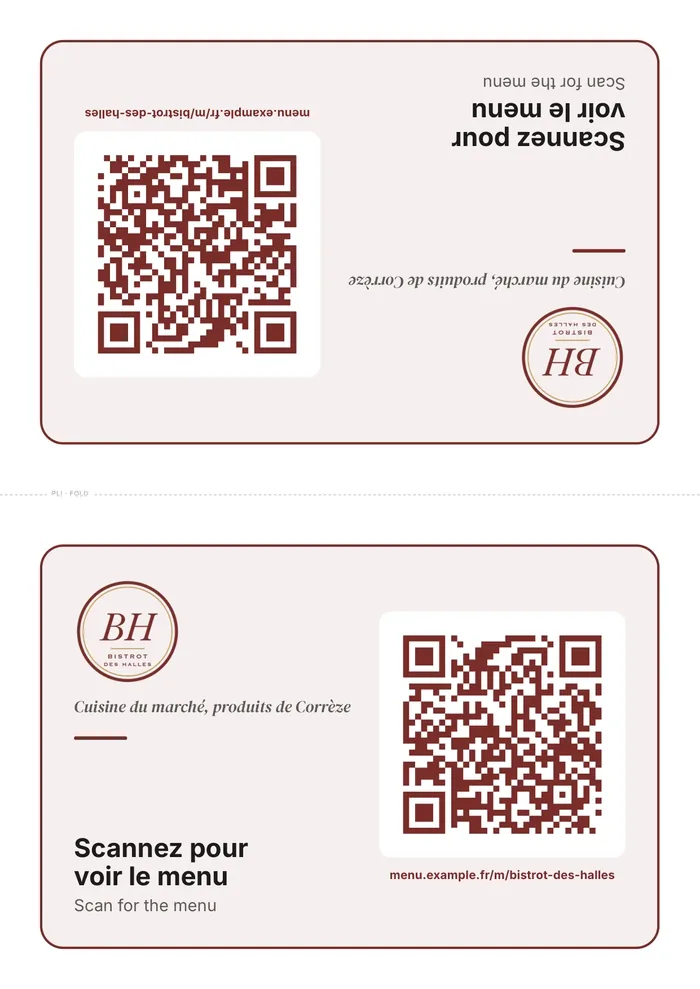</td>
    <td>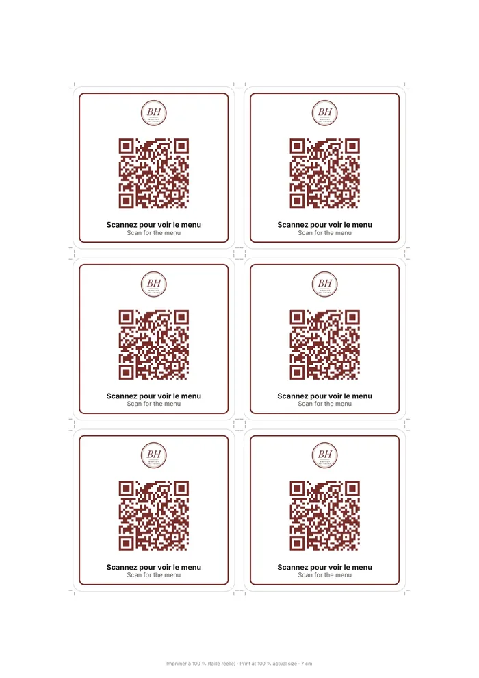</td>
  </tr>
  <tr>
    <td align="center"><sub>A5 table tent (fold in the middle)</sub></td>
    <td align="center"><sub>7 cm stickers on A4 with cut marks</sub></td>
  </tr>
</table>

The QR code always encodes the restaurant's **permanent** URL. The slug is locked as soon as the
restaurant is published, so printed material never breaks, while every later edit goes live
immediately.

## Tech stack

| Layer | Choice |
|---|---|
| Backend | Python 3.13, Django 5.2 LTS, SQLite (WAL) |
| Admin UI | Django templates, HTMX, SortableJS, vanilla JS (no build step) |
| Public menu | Server-rendered templates, inline CSS, OKLCH theming, self-hosted WOFF2 fonts, SVG icon sprite |
| Images | Pillow: EXIF rotation, metadata stripping, WebP variants, decompression-bomb guard |
| QR / PDF | segno, WeasyPrint |
| AI | Anthropic Python SDK (vision + structured output), pydantic |
| Ops | Docker Compose, gunicorn, WhiteNoise, Caddy (automatic HTTPS, zstd/gzip) |
| Quality | pytest + pytest-django, Playwright, axe-core, Lighthouse, ruff, GitHub Actions |

## Engineering notes

- **Content-versioned caching.** Every change to a restaurant, category, dish or special bumps a
  content version (model API plus signals). Public pages are cached per version and served
  with ETags, so diners see a sold-out toggle within seconds without any cache purging.
- **Translatable data model.** Text fields are JSON dicts (`{"fr": ..., "en": ...}`) with a
  fallback helper, so adding a third language is a small change. Prices are integer cents.
- **Security.** Throttled admin login, CSRF everywhere, strict CSP and Permissions-Policy on
  public pages, `noindex` on the admin, HSTS through Caddy, upload size and pixel limits, and a
  container that refuses to start on HTTPS with demo or placeholder secrets. See
  [SECURITY.md](SECURITY.md).
- **Design process.** The public menu was designed before it was built: [DESIGN.md](DESIGN.md)
  covers UX architecture, theme identities, colour maths and performance budgets, and
  [docs/screenshots/](docs/screenshots/) holds the full screenshot matrix and critique log.
- **QA.** [docs/qa/](docs/qa/) contains the diner-UX checklist and the Lighthouse runs against
  the production Docker stack.

## Quick start

With Docker (no configuration needed, demo data included):

```bash
docker compose up --build
```

Open <http://localhost:8080/m/chez-gino/> for a public menu and <http://localhost:8080/admin/>
for the editor (`admin` / `local-admin-password`). These defaults are for local use only.

Without Docker (Python 3.13, [uv](https://docs.astral.sh/uv/), and pango for PDF export):

```bash
uv sync
export DJANGO_DEBUG=1
uv run python manage.py migrate
uv run python manage.py seed_demo --admin-password devpassword123
uv run python manage.py runserver
uv run pytest            # unit tests
uv run pytest e2e        # end-to-end tests (Playwright)
```

Demo menus: `/m/bistrot-des-halles/`, `/m/chez-gino/`, `/m/petit-kiosque/`,
`/m/maison-vialle/`, `/m/auberge-du-puy-blanc/`.

## Documentation

- [User guide](docs/USER_GUIDE.md): editor walkthrough, printing, AI import
- [Running and deploying](docs/DEPLOYMENT.md): local dev, configuration, VPS deployment with HTTPS, backups, troubleshooting
- [Architecture](docs/ARCHITECTURE.md): stack decisions, data model, routes and contracts
- [Design system](DESIGN.md): public menu UX and themes

## License

Copyright © 2026 Yaroslav. All rights reserved. The source is published for review only; see
[LICENSE](LICENSE). Fonts, vendored libraries and demo photos keep their own licences.
